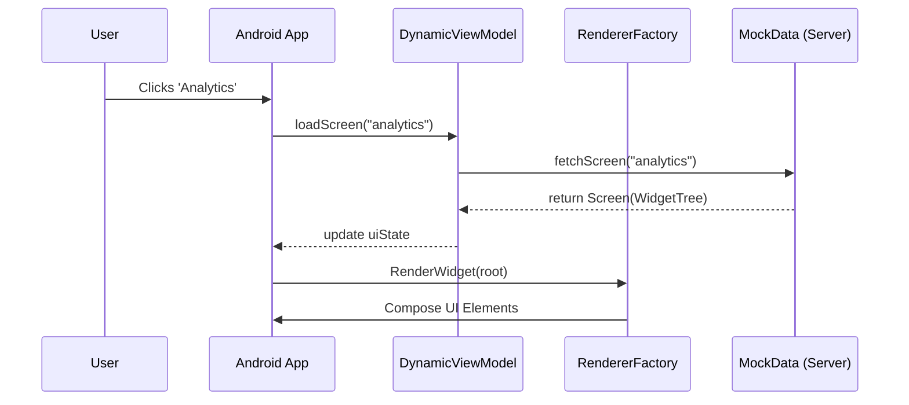

# How to Use: Dynamic Banking SDUI POC

This guide explains how to interact with the Server-Driven UI (SDUI) framework and extend it.

## 1. Running the POC
1. Open the project in **Android Studio**.
2. Select the `app` module and click **Run**.
3. The app starts on the `home` screen. All elements you see (cards, buttons, lists) are rendered from a JSON-like structure provided by `MockData.kt`.

## 2. Navigating the App
- **Click on the Balance Card**: Navigates to the "Balance Details" screen.
- **Click on 'Analytics' Quick Action**: Navigates to the "Spending Analytics" screen which renders a Vico Chart.
- **Click on 'History' Quick Action**: Navigates to the "Transaction History" list.

## 3. Adding a New Widget
To add a new UI component to the framework:
1. **Define the Model**: Add any specific properties to the `Widget` class in `:core-model` if necessary (usually `properties: JsonObject` is enough).
2. **Create a Renderer**:
   ```kotlin
   class MyNewRenderer : WidgetRenderer {
       @Composable
       override fun Render(widget: Widget, rendererFactory: RendererFactory) {
           val text = widget.properties?.get("text")?.jsonPrimitive?.content ?: ""
           Text(text = "New Widget: $text")
       }
   }
   ```
3. **Register the Renderer**: Add it to the `RendererFactoryImpl` in `:core-renderer`.
4. **Update the "Server"**: Add the new widget type to a screen in `MockData.kt`.

## 4. Simulating Chat-Based Rendering
The POC supports navigation via commands. To simulate a chat-based intent:
1. Trigger `viewModel.loadScreen("analytics")` based on a "Show me my spends" text input.
2. The `RendererFactory` will automatically fetch the correct composables to build the requested screen.

## 5. Architecture Diagram

