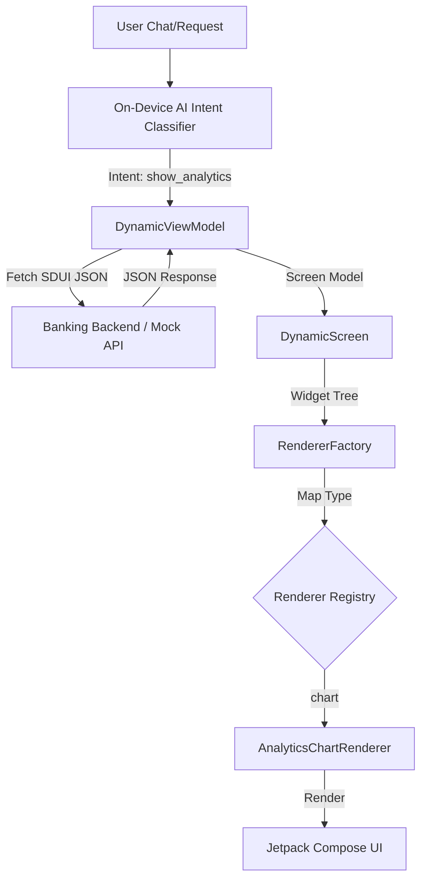

# Dynamic Banking POC Architecture & Implementation

## 1. Overview
This project demonstrates a **Server-Driven UI (SDUI)** framework tailored for banking applications. The UI is not hardcoded; instead, the backend (or a local AI model) sends a JSON structure describing the UI, which the app renders dynamically using Jetpack Compose.

## 2. Core Implementation Strategy
The rendering engine uses a **Recursive Tree Traversal** strategy:
1. **Model**: The `Screen` contains a root `Widget`.
2. **Renderer Factory**: A central registry that maps `Widget.type` to a specific `WidgetRenderer` implementation.
3. **Recursive Rendering**: Layout widgets (like `row`, `column`, `lazy_column`) call the `RendererFactory` to render their children, enabling deeply nested dynamic layouts.

## 3. Modular Architecture
The project is split into several modules to ensure scalability and separation of concerns:
- `:core-model`: Shared data structures (`Widget`, `Action`, `Screen`).
- `:core-renderer`: The logic that maps JSON/Models to Compose UI.
- `:feature-*`: Specific business components (e.g., `:feature-analytics` for charts).
- `:mock-api`: Simulates the server response.
- `:navigation`: A decoupled navigation system that handles dynamic routes.

## 4. SDUI Component Diagram

## 5. Security & Real-world Banking Integration
> ### 🔒 Security & AI Integration Architecture
> To implement this in a real-life production banking environment:
>
> 1. **On-Device AI (The Intent Engine)**:
>    - Use **Google AICore** (on Pixel/S24) or **MediaPipe LLM Inference** to classify user queries locally.
>    - *Example*: "How much did I spend on Amazon?" -> Intent: `view_analytics`, Entity: `Amazon`.
>
> 2. **MCP (Model Context Protocol)**:
>    - Implement an **MCP Server** on your banking backend.
>    - The Android app acts as an **MCP Client**.
>    - The AI model uses MCP to call "Tools" (e.g., `get_transactions`, `get_balance`) which return SDUI JSON widgets instead of raw data.
>
> 3. **Banking Security Access**:
>    - **Biometric Enforcement**: The `RendererFactory` should wrap sensitive widgets in a `SecurityWrapper` that requires a valid Biometric Session before rendering or interaction.
>    - **Trusted Execution**: Use `Hardware-backed Keystore` to sign MCP requests, ensuring the server only responds to legitimate, untampered app instances.
>    - **Screen Masking**: Automatically hide sensitive dynamic widgets when the app is in the background or during screen recording.

## 6. Dynamic Rendering Flow
1. **Request**: The user asks a question via voice or text.
2. **Analysis**: On-device AI determines the required "Screen" or "Widget".
3. **Delivery**: The backend sends a `Widget` tree optimized for that specific query.
4. **Rendering**: The app's `RendererFactory` instantly builds the UI without an app update.
